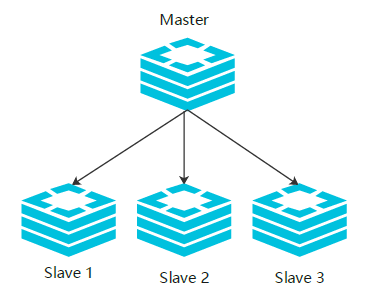
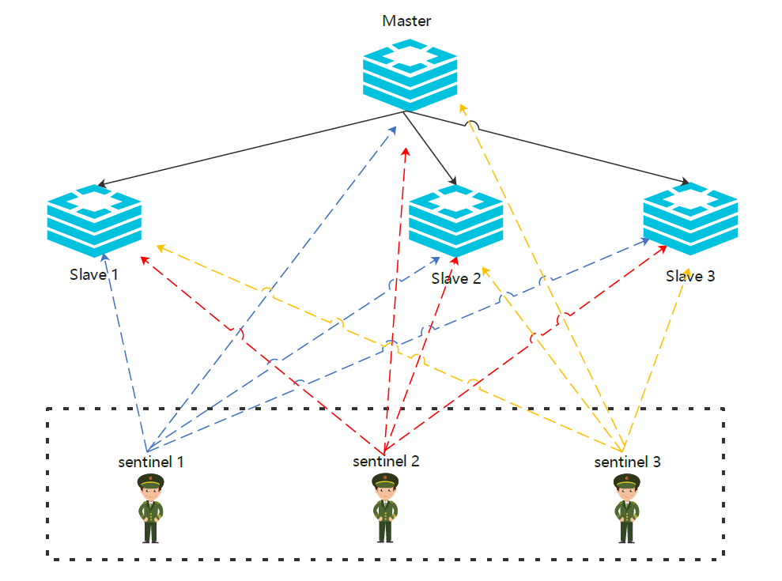
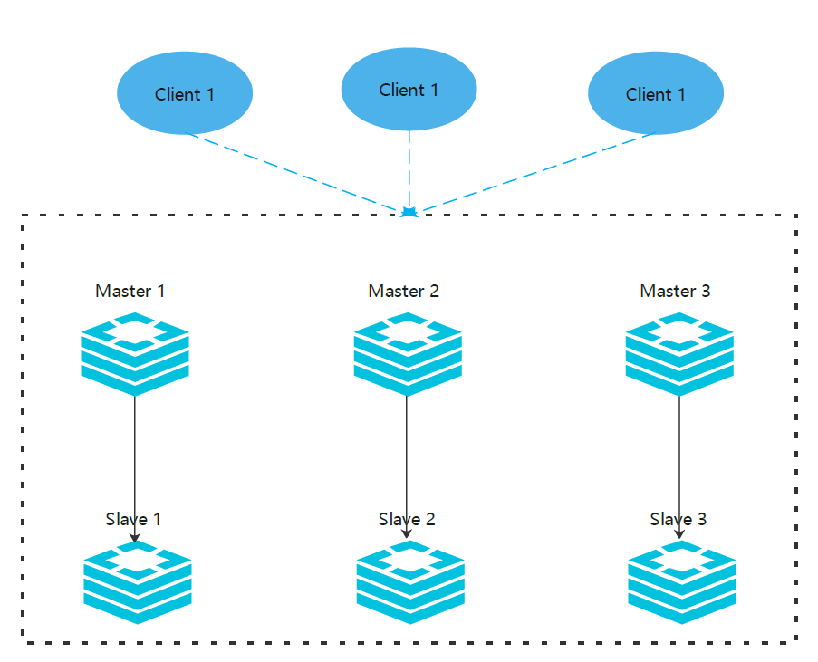

# Redis哨兵机制和集群有什么区别

> Redis集群有几种实现方式，分别是主从模式、哨兵模式、Cluster模式

## 回答
Redis高可用的常用两种模式分别是哨兵模式和Cluster模式，这两种模式的区别可以从以下三个方面来回答

1. Redis哨兵模式是基于主从复制来实现的，所以它可以实现读写分离，分担Redis读操作的压力；
而Redis Cluster模式的Slave节点只是冷备节点，它只有在master节点宕机后才工作；
2. Redis哨兵模式无法在线扩容，所以它的并发压力受限于单个服务器的资源配置；
Redis Cluster模式提供了基于Slot槽的数据分片机制，可以实现在线扩容提升写数据的性能；
3. 从集群架构上来说，Redis哨兵模式是一主多从，而Redis Cluster模式是多主多从

## 知识点记录

### 1. 主从模式
主从模式下，当主服务器宕机后，需要手动把一台从服务器切换为主服务器，这就需要人工干预，费事费力，还会造成一段时间内服务不可用。

生产中一般不使用主从模式

### 2. 哨兵模式
实际生产中优先考虑哨兵模式，这种模式下，`master`宕机，哨兵会自动选举`master`并将其他的`slave`指向新的`master`。

在主从模式下，redis同时提供了哨兵命令`redis-sentinel`，哨兵是一个独立的进程，作为进程，它会独立运行。
其原理是哨兵进程向所有的redis机器发送命令，等待Redis服务器响应，从而监控运行的多个Redis实例。

哨兵可以有多个，一般为了便于决策选举，使用奇数个哨兵。

哨兵可以和Redis机器部署在一起，也可以部署在其他的机器上。多个哨兵构成一个哨兵集群，哨兵直接也会相互通信，检查哨兵是否正常运行，同时发现`master`宕机哨兵之间会进行决策选举新的`master`

### 3. Cluster模式

**Redis 的Cluster模式本身没有使用一致性 hash 算法，而是使用 slots 插槽。**

Redis的哨兵模式基本已经实现高可用、读写分离，但是在这种模式下每台Redis服务器都存储相同的数据，很浪费内存，所以在Redis3.0上加入了Cluster集群模式，实现了Redis的分布式存储，对数据进行分片，也就是说每台Redis节点上存储不同的内容

这里的 6 台 redis 两两之间并不是独立的，每个节点都会通过集群总线(cluster bus)，与其他的节点进行通信。通讯时使用特殊的端口号，即对外服务端口号加 10000。例如如果某个 node 的端口号是 6379，那么它与其它 nodes 通信的端口号是 16379。nodes 之间的通信采用特殊的二进制协议。

**对客户端来说，整个 cluster 被看做是一个整体**。客户端可以连接任意一个 node 进行操作，就像操作单一 Redis 实例一样，当客户端操作的 key 没有分配到该 node 上时，Redis 会返回转向指令，指向正确的 node，这有点儿像浏览器页面的 302 redirect 跳转。

根据官方推荐，Cluster部署至少要 3 台以上的 master 节点，最好使用 3 主 3 从六个节点的模式。

### 总结

**主从模式**：master节点挂掉后，需要手动指定新的master，可用性不高，基本不用

**哨兵模式**：master节点挂掉后，哨兵进行会主动选举新的master，可用性高，但是每个节点存储的数据是一样的，浪费内存空间。
**数据量不是很多，集群规模不是很大，需要自动容错容灾的时候使用。**

**Cluster模式**：**数据量比较大，QPS要求较高的时候使用。**