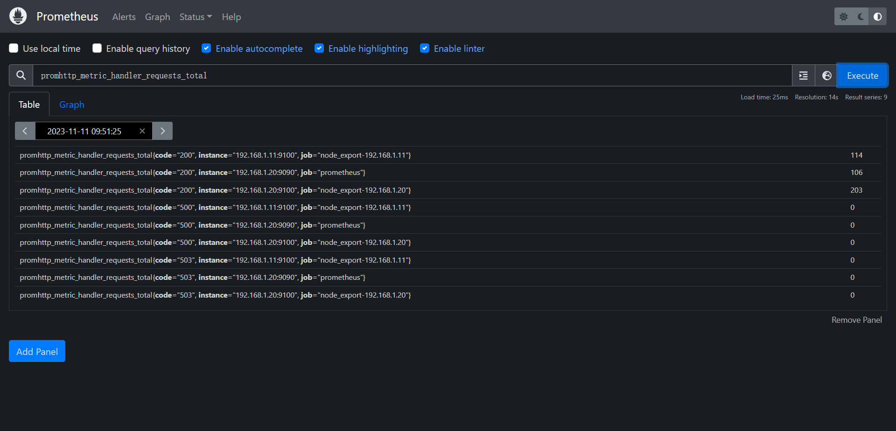
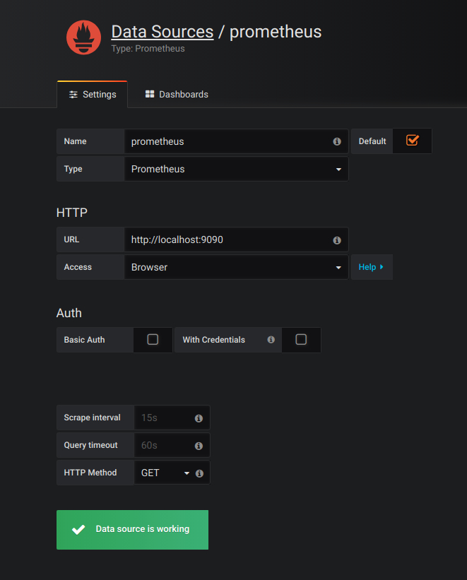
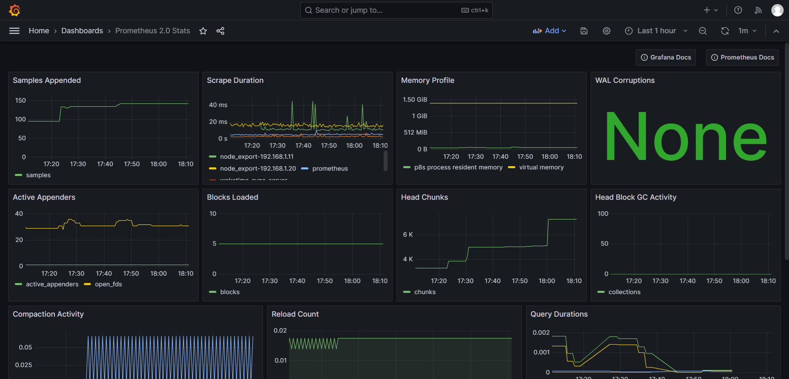

# Prometheus + Grafana监控搭建

___

## Prometheus

### 安装

> 192.168.1.20, 需要开启9090端口

1.下载

```shell
wget https://github.com/prometheus/prometheus/releases/download/v2.48.0-rc.2/prometheus-2.48.0-rc.2.linux-amd64.tar.gz

tar -xzvf prometheus-2.48.0-rc.2.linux-amd64.tar.gz
```

2.编写启动脚本

```shell
vim prometheus.sh

# prometheus.sh
echo "Prometheus Start!"
prometheus --config.file=/monitor/prometheus/prometheus/prometheus.yml --web.enable-lifecycle >/monitor/prometheus/prometheus.log 2>&1 &
```

3.编写yml文件

```shell
# my global config
global:
  scrape_interval: 15s # Set the scrape interval to every 15 seconds. Default is every 1 minute.
  evaluation_interval: 15s # Evaluate rules every 15 seconds. The default is every 1 minute.
  # scrape_timeout is set to the global default (10s).

# Alertmanager configuration
alerting:
  alertmanagers:
    - static_configs:
        - targets:
          # - alertmanager:9093

# Load rules once and periodically evaluate them according to the global 'evaluation_interval'.
rule_files:
  # - "first_rules.yml"
  # - "second_rules.yml"

# A scrape configuration containing exactly one endpoint to scrape:
# Here it's Prometheus itself.
scrape_configs:
  # The job name is added as a label `job=<job_name>` to any timeseries scraped from this config.
  - job_name: "prometheus"

    # metrics_path defaults to '/metrics'
    # scheme defaults to 'http'.

    static_configs:
      - targets: ["192.168.1.20:9090"]

  - job_name: "wakatime-sync-server"
    static_configs:
      - targets: ["192.168.1.17:9090"]
    metrics_path: '/actuator/prometheus'

  - job_name: "node_export-192.168.1.20"
    static_configs:
      - targets: ["192.168.1.20:9100"]

  - job_name: "node_export-192.168.1.11"
    static_configs:
      - targets: ["192.168.1.11:9100"]
```

4.**启动**

```shell
sh prometheus.sh
```

### 验证

打开地址：`http://192.168.1.20:9090/`

查询指标 `promhttp_metric_handler_requests_total`



## Docker

> 192.168.1.20，需要开启3000端口，使用docker安装

### 安装docker

[详细步骤](../Docker安装(Linux)-20231111.md)

**官方一键安装指令**

```shell
curl -fsSL https://get.docker.com | bash -s docker --mirror Aliyun
```

### 安装Grafana

1.安装

```shell
docker run -d -p 3000:3000 grafana/grafana
```

2.验证

打开地址： http://192.168.1.20:3000/ (admin/admin)

3.配置数据源



4.Import展示面板

Prometheus 2.0 Stats

