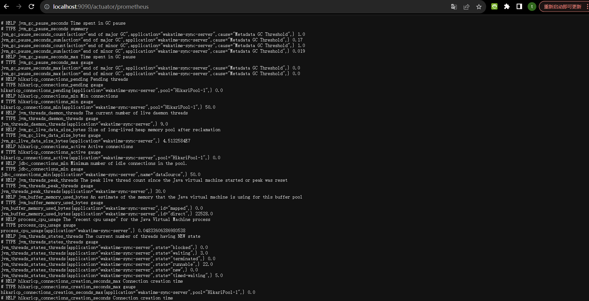
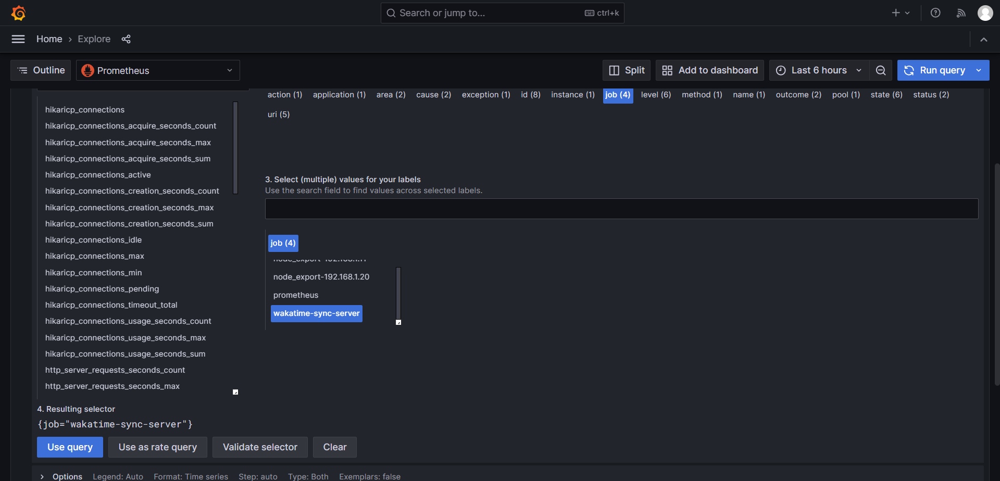
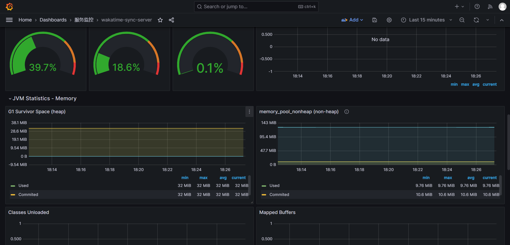

# Prometheus监控JMX(Java程序)

___

## Java配置

### 1.增加pom依赖

```xml
<!-- 监控指标上报 -->
<dependency>
    <groupId>org.springframework.boot</groupId>
    <artifactId>spring-boot-starter-actuator</artifactId>
</dependency>
<dependency>
<groupId>org.springframework.boot</groupId>
<artifactId>spring-boot-configuration-processor</artifactId>
<optional>true</optional>
</dependency>
<dependency>
<groupId>io.micrometer</groupId>
<artifactId>micrometer-registry-prometheus</artifactId>
</dependency>
```

### 2.增加配置文件

```yaml
management:
  # 端点信息接口使用的端口，为了和主系统接口使用的端口进行分离
  server:
    port: 9090
  # 端点健康情况，默认值"never"，设置为"always"可以显示硬盘使用情况和线程情况
  endpoint:
    health:
      show-details: always
  # 设置端点暴露的哪些内容，默认["health","info"]，设置"*"代表暴露所有可访问的端点
  endpoints:
    web:
      exposure:
        include: "*"
  metrics:
    tags:
      application: ${spring.application.name}
```

### 3.启动验证

验证地址： http://localhost:9090/actuator/prometheus



## Prometheus配置

### 1.增加prometheus.yml配置文件

```shell
scrape_configs:
  # The job name is added as a label `job=<job_name>` to any timeseries scraped from this config.
  - job_name: "prometheus"

    # metrics_path defaults to '/metrics'
    # scheme defaults to 'http'.

    static_configs:
      - targets: ["192.168.1.20:9090"]

  - job_name: "wakatime-sync-server"
    static_configs:
      - targets: ["192.168.1.17:9090"]
    metrics_path: '/actuator/prometheus'
```

### 重启prometheus服务

### 验证指标上报



### 配置Dashboard

[导入文件](./file/Prometheus监控Java服务/wakatime-sync-server-1699698466219.json)

