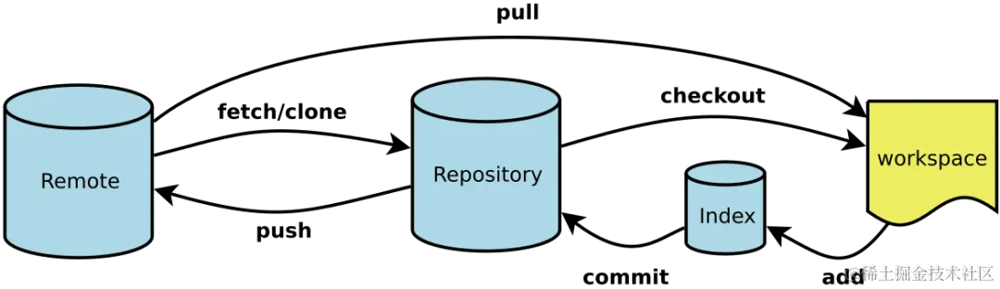

# Git使用指令记录

## 0. Git基本流程


## 1. 基本信息查看
```shell
# 1.1 查看远端链接情况
git remote -v

# 1.2 查看本地分支
git branch -v 
```

## 2.推送远端仓库流程
```shell
# 2.1 往本地缓存中添加代码
git add [filename]

# 2.2 合并本地变动代码
git commit -m '[content]'

# 2.3 推送到远端仓库
git push origin
```

## 3. 拉取远端仓库代码流程
### 3.1 自动合并分支(不推荐)
```sql
git pull origin master
```

### 3.2 手动合并分支
#### 3.2.1 方式一： 本地创建临时分支(不推荐)
```shell
# 3.1.1 拉取最新代码到本地临时分支
git fetch origin master:temp

# 3.1.2 与当前分支对比差异
git diff temp

# 3.1.3 检查后与当前分支合并
git merge temp

# 3.1.4 删除临时分支
git branch -D temp
```

#### 3.2.2 方式二： 直接合并(推荐使用)
```shell
# 3.2.1 获取最新代码到本地
git fetch origin master [获取远端的origin/master分支]

# 3.2.2 查看版本差异
git log -p master [查看本地master与远端origin/master的版本差异]

# 3.2.3 合并最新代码到本地分支
git merge origin/master [合并远端分支origin/master到当前分支]
```

## 4. 删除
```shell
git branch -D temp [删除本地temp分支]
```

## 5. 增删远程仓库地址
### 5.1 查看远程仓库地址
```shell
git remote -v
```

### 5.2 修改远程仓库地址
```shell
git remote set-url origin <remote-url>
```

### 5.3 添加远程仓库
```shell
git remote add origin-name <项目地址>  
# 注：项目地址形式为：https://gitee.com/xxx/xxx.git或者git@gitee.com:xxx/xxx.git
```

### 5.4 删除远程仓库
```shell
git remote rm origin-name
```