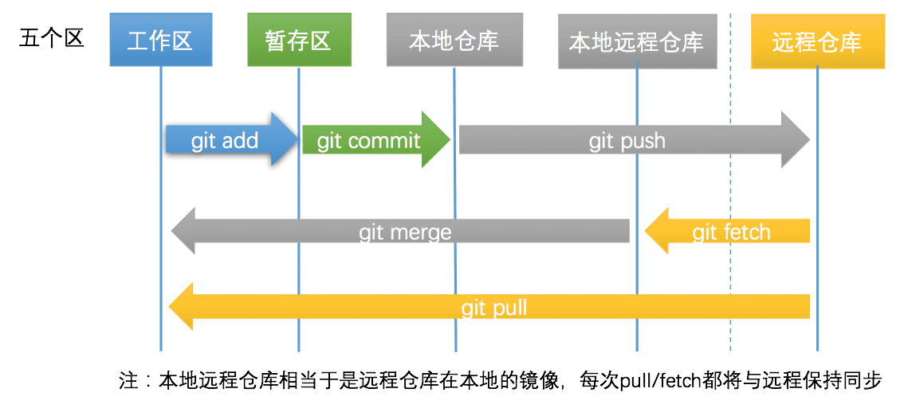
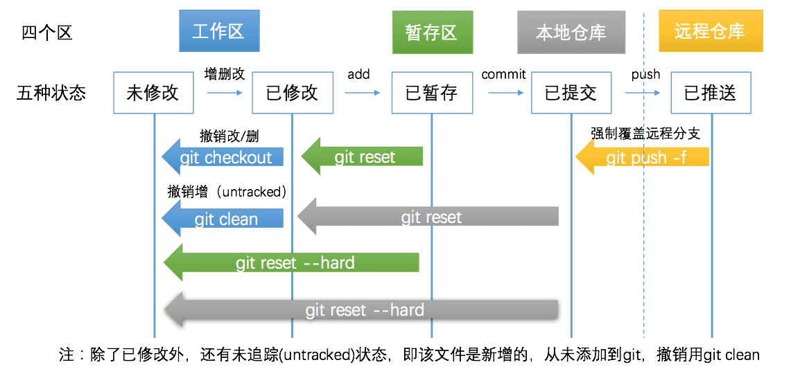

# Git详解

___

## Git操作流程

### 代码提交和同步代码



### 代码撤销和撤销同步



注：
从本地仓库回退到工作区可使用指令(保存已修改的内容)

```shell
git reset HEAD^
```

## Git常用操作命令 - 代码提交和同步代码

- 第零步：工作区与仓库保持一致
- 第一步：文件增删改，变为已修改状态
- 第二步：`git add`，变为已暂存状态

```shell
git status # 查看本地分支与远端分支文件对比
git add --all # 当前项目下的所有更改
git add .  # 当前目录下的所有更改
git add xx/xx.py xx/xx2.py  # 添加某几个文件
```

第三步：`git commit`，变为已提交状态

```shell
git commit -m "<这里写commit的描述>"
```

第四步：`git push`，变为已推送状态

```shell
git push -u origin master # 第一次需要关联上分支名
git push # 之后再推送就不用指明应该推送的远程分支了
git branch # 可以查看本地仓库的分支
git branch -a # 可以查看本地仓库和本地远程仓库(远程仓库的本地镜像)的所有分支
```

> 日常使用最多的操作

```shell
git status
git add -A / git add --all
git status
git commit -m 'reason'
git push gitee / git push gitee xxbranch
git pull --rebase # 基于本地分支尝试线性合并远端分支
```

## Git常用操作命令 - 代码撤销和撤销同步

### 已修改，但未暂存

```shell
git diff # 列出所有的修改
git diff xx/xx.py xx/xx2.py # 列出某(几)个文件的修改

git checkout # 撤销项目下所有的修改
git checkout . # 撤销当前文件夹下所有的修改
git checkout xx/xx.py xx/xx2.py # 撤销某几个文件的修改
git clean -f # untracked状态，撤销新增的文件
git clean -df # untracked状态，撤销新增的文件和文件夹

# Untracked files:
#  (use "git add <file>..." to include in what will be committed)
#
#	xxx.py
```

### 已暂存，未提交

> 这个时候已经执行过`git add`，但未执行`git commit`，但是用`git diff`已经看不到任何修改。
> 因为git diff检查的是工作区与暂存区之间的差异。

```shell
git diff --cached # 这个命令显示暂存区和本地仓库的差异

git reset # 暂存区的修改恢复到工作区
git reset --soft # 与git reset等价，回到已修改状态，修改的内容仍然在工作区中
git reset --hard # 回到未修改状态，清空暂存区和工作区
```

> `git reset --hard` 操作等价于 `git reset` 和 `git checkout` 两步操作

### 已提交，未推送

> 执行完commit之后，会在仓库中生成一个版本号(hash值)，标志这次提交。
> 之后任何时候，都可以借助这个hash值回退到这次提交。

```shell
git diff <branch-name1> <branch-name2> # 比较2个分支之间的差异
git diff master origin/master # 查看本地仓库与本地远程仓库的差异

git reset --hard origin/master # 回退与本地远程仓库一致
git reset --hard HEAD^ # 回退到本地仓库上一个版本
git reset --hard <hash code> # 回退到任意版本
git reset --soft/git reset # 回退且回到已修改状态，修改仍保留在工作区中。
```

### 已推送到远程

```shell
git push -f orgin master # 强制覆盖远程分支
git push -f # 如果之前已经用 -u 关联过，则可省略分支名
```

> 慎用，一般情况下，本地分支比远程要新，所以可以直接推送到远程，但有时推送到远程后发现有问题，进行了版本回退，旧版本或者分叉版本推送到远程，需要添加
> -f参数，表示强制覆盖。

## Git常用操作命令 - 其它常用命令

### 关联远程仓库

- 如果还没有Git仓库，你需要

```shell
git init
```

- 关联远程仓库

```shell
$ git remote add <name> <git-repo-url>
# 例如 git remote add origin https://github.com/xxxxxx # 是远程仓库的名称，通常为 origin
```

- 关联多个远程仓库

```shell
$ git remote add <name> <another-git-repo-url>
# 例如 git remote add coding https://coding.net/xxxxxx
```

- 查看已经关联的仓库

```shell
git remote -v
# gitee   https://gitee.com/ztop1024/webnode.git (fetch)
# gitee   https://gitee.com/ztop1024/webnode.git (push)
# github  https://github.com/ZTop1024/webnode.git (fetch)
# github  https://github.com/ZTop1024/webnode.git (push)
```

- clone远程仓库到本地

```shell
git clone <git-repo-url>
# 关联的远程仓库将被命名为origin，这是默认的。
```

- 更改远程仓库地址

```shell
git remote set-url origin <your-git-url>
```

### 切换分支

> 新建仓库后，默认生成了master分支

- 新建分支并切换

```shell
git checkout -b <new-branch-name>
# 例如 git checkout -b dev
# 如果仅新建，不切换，则去掉参数 -b
```

- 查看当前分支

```shell
git branch
# * dev
#   master # 标*号的代表当前所在的分支
```

- 查看当前本地&远程的所有分支

```shell
git branch -a
# * dev
#   master
#   remotes/origin/master
```

- 切换到现有的分支

```shell
git checkout master
```

- 把dev分支合并到master分支

```shell
git merge <branch-name>
# 例如 git merge dev
```

- 把本地master分支推送到远程

```shell
git push origin master
# 你可以使用git push -u origin master将本地分支与远程分支关联，之后仅需要使用git push即可。
```

- 拉取远程分支最新代码到本地

```shell
git pull origin <branch-name>
# 之前如果push时使用过-u，那么就可以省略为git pull
```

- 暂存本地工作区修改，再拉取远程代码

```shell
git stash # 工作区修改暂存
git pull  # 更新分支
git stash pop # 暂存修改恢复到工作区
```

### 撤销操作

- 恢复暂存区文件到工作区

```shell
git checkout <file-name>
```

- 恢复暂存区的所有文件到工作区

```shell
git checkout .
```

- 重置暂存区的某文件，与上一次commit保持一致，但工作区不变

```shell
git reset <file-name>
```

- 重置暂存区与工作区，与上一次commit保持一致

```shell
git reset --hard <file-name>
# 如果是回退版本(commit)，那么file，变成commit的hash码就好了。
```

- 去掉某个commit

```shell
git revert <commit-hash>
# 实质是新建了一个与原来完全相反的commit，抵消了原来commit的效果
```

- reset回退错误恢复

```shell
git reflog #查看最近操作记录
git reset --hard HEAD{5} #恢复到前五笔操作
git pull origin backend-log #再次拉取代码
```

### 版本回退与前进

- 查看历史版本

```shell
git log

git log --graph --decorate --abbrev-commit --all
```

- 检出到任意版本

```shell
git checkout a5d88ea
# hash码很长，通常6-7位就够了
```

- 远程仓库的版本很新，但是你还是想用老版本覆盖

```shell
git push origin master --force
# 或者 git push -f origin master
```

- 觉得commit太多了? 多个commit合并为1个

```shell
git rebase -i HEAD~4
# 这个命令，将最近4个commit合并为1个，HEAD代表当前版本。将进入VIM界面，你可以修改提交信息。推送到远程分支的commit，不建议这样做，多人合作时，通常不建议修改历史。
```

- 想回退到某一个版本

```shell
git reset --hard <hash>
# 例如 git reset --hard a3hd73r
# --hard代表丢弃工作区的修改，让工作区与版本代码一模一样，与之对应，--soft参数代表保留工作区的修改。
```

- 想回退到上一个版本，有没有简便方法?

```shell
git reset --hard HEAD^
```

- 回退到上上个版本呢?

```shell
git reset --hard HEAD^^
# HEAD^^可以换作具体版本hash值。
```

- 回退错了，能不能前进呀

```shell
git reflog
# 这个命令保留了最近执行的操作及所处的版本，每条命令前的hash值，则是对应版本的hash值。使用上述的git checkout 或者 git reset命令 则可以检出或回退到对应版本。
```

- 刚才commit信息写错了，可以修改吗

```shell
git commit --amend
```

- 看看当前状态吧

```shell
git status
```

### 配置属于你的git

- 看看当前的配置

```shell
git config --list
```

- 估计你需要配置你的名字

```shell
git config --global user.name "<name>"
#  --global为可选参数，该参数表示配置全局信息
```

- 希望别人看到你的commit可以联系到你

```shell
git config --global user.email "<email address>"
```

- 有些命令很长，能不能简化一下

```shell
git config --global alias.logg "log --graph --decorate --abbrev-commit --all"
# 之后就可以开心地使用 git log了
```