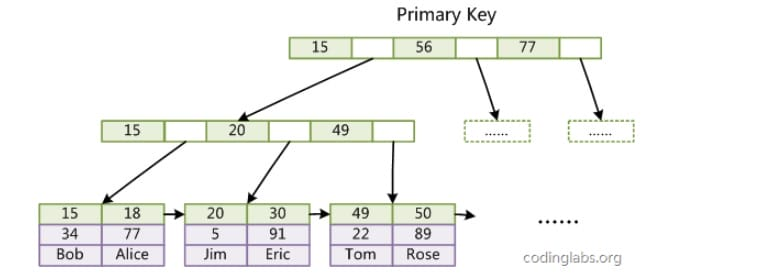
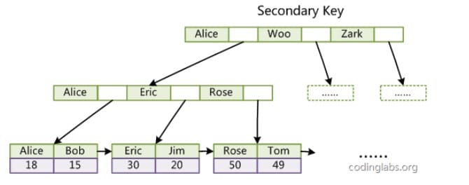

---
tags:
  - 数据库知识体系
  - MySQL
---
# MySQL索引知识
___

## 1. MySQL 索引
索引是在存储引擎层实现的，而不是在服务器层实现的，所以不同存储引擎具有不同的索引类型和实现。
### 1.1 B+Tree 索引
是大多数 MySQL 存储引擎的默认索引类型。

因为不再需要进行全表扫描，只需要对树进行搜索即可，因此查找速度快很多。

除了用于查找，还可以用于排序和分组。

可以指定多个列作为索引列，多个索引列共同组成键。

适用于全键值、键值范围和键前缀查找，其中键前缀查找只适用于最左前缀查找。

如果不是按照索引列的顺序进行查找，则无法使用索引。

InnoDB 的 B+Tree 索引分为主索引(聚束索引)和辅助索引(非聚束索引)。

#### 聚束索引

聚束索引的叶子节点 data 域记录着完整的数据记录，这种索引方式被称为聚簇索引。

因为无法把数据行存放在两个不同的地方，所以一个表只能有一个聚簇索引。



#### 非聚束索引

辅助索引的叶子节点的 data 域记录着主键的值，因此在使用辅助索引进行查找时，需要先查找到主键值，然后再到主索引中进行查找。

这个过程也叫做回表。



### 1.2 哈希索引

哈希索引能以 O(1) 时间进行查找，但是失去了有序性，它具有以下限制:

- 无法用于排序与分组；
- 只支持精确查找，无法用于部分查找和范围查找。

InnoDB 存储引擎有一个特殊的功能叫“自适应哈希索引”，当某个索引值被使用的非常频繁时，会在 B+Tree 索引之上再创建一个哈希索引，这样就让 B+Tree 索引具有哈希索引的一些优点，比如快速的哈希查找。

[哈希索引原理过程](./002.MySQL哈希索引原理过程.md)
### 1.3 全文索引

MyISAM 存储引擎支持全文索引，用于查找文本中的关键词，而不是直接比较是否相等。查找条件使用 MATCH AGAINST，而不是普通的 WHERE。

全文索引一般使用倒排索引实现，它记录着关键词到其所在文档的映射。

InnoDB 存储引擎在 MySQL 5.6.4 版本中也开始支持全文索引。

### 1.4 空间数据索引

MyISAM 存储引擎支持空间数据索引(R-Tree)，可以用于地理数据存储。空间数据索引会从所有维度来索引数据，可以有效地使用任意维度来进行组合查询。

必须使用 GIS 相关的函数来维护数据。

### 1.5 唯一索引

建议使用普通索引，唯一索引无法使用`change buffer`，内存命中率低

## 2. 索引优化

### 2.1 独立的列

在进行查询时，索引列不能是表达式的一部分，也不能是函数的参数，否则无法使用索引。

例如下面的查询不能使用 actor_id 列的索引:

```sql
SELECT actor_id FROM sakila.actor WHERE actor_id + 1 = 5;
```

### 2.2 多列索引(最左前缀原则)

在需要使用多个列作为条件进行查询时，使用多列索引比使用多个单列索引性能更好。例如下面的语句中，最好把 actor_id 和 film_id 设置为多列索引。

```sql
SELECT film_id, actor_id FROM sakila.film_actor
WHERE actor_id = 1 AND film_id = 1;
```

在Mysql中执行查询时，只能使用一个索引，如果我们在`actor_id`和`film_id`上分别建索引，则只能使用其中一个索引

Mysql会选择一个最严格的索引(即获得结果集记录数最少的索引)

联合索引建立原则：
- 如果通过调整，可以少维护一个索引，那么这个顺序往往就是需要优先考虑采用的
- 空间：优先小字段单独建立索引，例如：name、age，可建立(name,age)联合索引和(age)单字段索引

最左前缀原则：
如果创建了`(Iname, fname, age)`多列索引，相当于创建了`(Iname)`单列索引，`(Iname, fname)`多列索引以及`(Iname, fname, age)`多列索引

### 2.3 索引列的顺序

让选择性最强的索引列放在前面，索引的选择性是指: 不重复的索引值和记录总数的比值。最大值为 1，此时每个记录都有唯一的索引与其对应。选择性越高(越接近1)，查询效率也越高。

例如下面计算索引选择性的结果中 customer_id 的选择性比 staff_id 更高，因此最好把 customer_id 列放在多列索引的前面。

```sql
SELECT COUNT(DISTINCT staff_id) / COUNT(*)    AS staff_id_selectivity,
       COUNT(DISTINCT customer_id) / COUNT(*) AS customer_id_selectivity,
       COUNT(*)
FROM payment;
```
```sql
   staff_id_selectivity: 0.0001
customer_id_selectivity: 0.0373
               COUNT(*): 16049
```

### 2.4 前缀索引

对于 BLOB、TEXT、CAHR 和 VARCHAR 类型的列，必须使用前缀索引，只索引开始的部分字符。

对于前缀长度的选取需要根据索引选择性来确定。

使用方式：
预先计算索引的选择性
```sql
ALTER TABLE table_name ADD KEY(column_name(prefix_length));
```

使用场景：
- 字符串列(BLOB、TEXT、CAHR 和 VARCHAR)，需要进行全字段匹配或者前匹配时。即 = 'xxx' 或者 like 'xxx%'
- **字符串本身可能比较长，而且前几个字符就开始不相同。** 比如我们对中国人的姓名使用前缀索引就没啥意义，因为中国人名字都很短，另外对收件地址使用前缀索引也不是很实用，因为一方面收件地址一般都是以XX省开头，也就是说前几个字符都是差不多的，而且收件地址进行检索一般都是like ’%xxx%’，不会用到前匹配。相反对外国人的姓名可以使用前缀索引，因为其字符较长，而且前几个字符的选择性比较高。同样电子邮件也是一个可以使用前缀索引的字段。
- **前一半字符的索引选择性就已经接近于全字段的索引选择性。** 如果整个字段的长度为20，索引选择性为0.9，而我们对前10个字符建立前缀索引其选择性也只有0.5，那么我们需要继续加大前缀字符的长度，但是这个时候前缀索引的优势已经不明显，没有太大的建前缀索引的必要了。

### 2.5 覆盖索引

索引包含所有需要查询的字段的值。

具有一下优点：
- 索引通常远小于数据行的大小，只读取索引能大大减少数据访问量。
- 一些存储引擎(例如 MyISAM)在内存中只缓存索引，而数据依赖于操作系统来缓存。因此，只访问索引可以不使用系统调用(通常比较费时)。
- 对于 InnoDB 引擎，若辅助索引能够覆盖查询，则无需访问主索引。

例如：
```sql
-- 只需要查 ID 的值，而 ID 的值已经在 k 索引树上了，因此可以直接提供查询结果，不需要回表
select ID from T where k between 3 and 5

-- 增加字段V，每次查询需要返回V，可考虑把k、v做成联合索引
select ID,V from T where k between 3 and 5
```

## 3. 索引学习小结

### 3.1 索引的优点

- 大大减少了服务器需要扫描的数据行数。
- 帮助服务器避免进行排序和分组，也就不需要创建临时表(B+Tree 索引是有序的，可以用于 ORDER BY 和 GROUP BY 操作。临时表主要是在排序和分组过程中创建，因为不需要排序和分组，也就不需要创建临时表)。
- 将随机 I/O 变为顺序 I/O(B+Tree 索引是有序的，也就将相邻的数据都存储在一起)。

### 3.2 索引的使用场景

- 对于非常小的表、大部分情况下简单的全表扫描比建立索引更高效。
- 对于中到大型的表，索引就非常有效。
- 但是对于特大型的表，建立和维护索引的代价将会随之增长。这种情况下，需要用到一种技术可以直接区分出需要查询的一组数据，而不是一条记录一条记录地匹配，例如可以使用分区技术。

### 3.3 避免索引失效
- 不做列运算，包括函数的使用，可能破坏索引值的有序性
- 避免 `%xxx` 式查询使索引失效
- `or` 语句前后没有同时使用索引，当`or`左右查询字段只有一个是索引，该索引会失效
- 组合索引ABC问题，不符合最左前缀原则
- 隐式类型转换
- 隐式字符编码转换
- 优化器放弃索引，回表、排序成本等因素影响，改走其它索引或者全部扫描