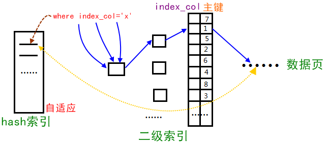

---
tags:
  - 数据库知识体系
  - MySQL
---
# MySQL哈希索引原理过程
___

#### 原理过程

Innodb存储引擎会监控对表上二级索引的查找，如果发现某二级索引被频繁访问，二级索引成为热数据，建立哈希索引可以带来速度的提升

1. 开启自适应hash索引功能
2. 经常访问的二级索引数据会自动被生成到hash索引里面去(最近连续被访问三次的数据)，自适应哈希索引通过缓冲池的B+树构造而来，因此建立的速度很快。