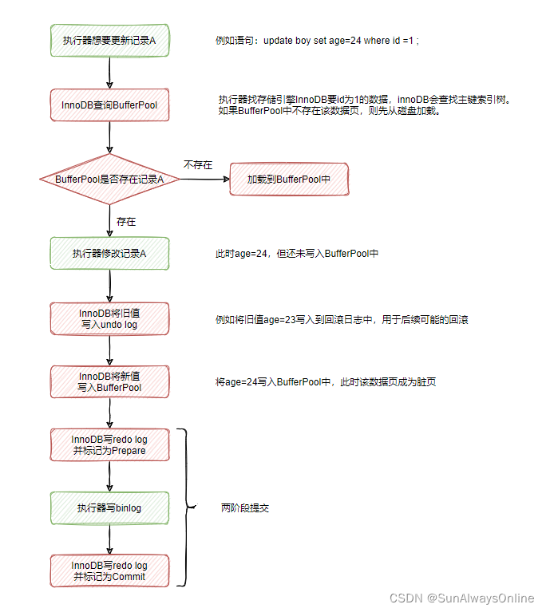

---
tags:
  - 数据库知识体系
  - MySQL
---
# MySQL两阶段提交

___

> MySQL innoDB使用两阶段提交，主要是为了在崩溃恢复时确保数据一致性

## MySQL日志系统

> MySQL(InnoDB)中的三种日志，`binlog`、`redo log`和`undo log`

### binlog与redo log的区别

|          |        **binlog**        |     **redo log**      |
|----------|:------------------------:|:---------------------:|
| **日志归属** |  由server层实现，所有存储引擎都可以使用  |     InnoDB引擎特有的日志     |
| **日志类型** | 逻辑日志，记录原始的SQL逻辑或数据变更前后内容 | 物理日志，记录在哪个数据页上进行了哪些更改 |
| **写入方式** |    追加写，写满则创建一个新文件继续写     |     循环写，全部写满就从头开始     |
| **使用场景** |        主从同步与误删恢复         |         崩溃恢复          |

总的来说，`binlog`用于维护集群内数据的一致性，`redo log`用于崩溃恢复

### undo log

> `undo log`主要用于事务回滚时恢复原来的数据

MySQL在执行sql语句时，会将一条逻辑相反的日志保存到undo log中。因此，undo log中记录的也是逻辑日志。

1. 当sql语句为insert时，会在undo log中记录本次插入的主键id。事务回滚时，delete此id即可；
2. 当sql语句为update时，会在undo log中记录修改前的数据。事务回滚时，再执行一次update，就得到了原来的数据；
3. 当sql语句为delete时，会在undo log中记录删除前的数据。事务回滚时，insert原来的数据即可；

## 两阶段提交

InnoDB在写redo log时，并不是一次性写完的，而有两个阶段，Prepare和Commit阶段

### 为什么要写redo log

**用于崩溃恢复**

MySQL为了提升性能，引入了BufferPool缓冲池。查询数据时，先从BufferPool中查询，查询不到则从磁盘加载到BufferPool中。

每次对数据的更新，也不总是能实时刷新到磁盘，而是先同步到BufferPool中，涉及到的数据页就会变成脏页。

同时会启动后台线程，异步地将脏页刷新到磁盘中，来完成BufferPool与磁盘的数据同步。

如果在某个时间，MySQL突然崩溃，则内存中的BufferPool就会丢失，剩余未同步的数据就会直接消失。

虽然在更新BufferPool后，也写入了binlog中，但binlog并不具备crash-safe的能力。

因为崩溃可能发生在写binlog后，刷脏前。在主从同步的情况下，从节点会拿到多出来的一条binlog。

所以server层的binlog是不支持崩溃恢复的，只是支持误删数据恢复。InnoDB考虑到这一点，自己实现了redo log。

### 为什么要写两次redo log

如果binlog和redo log都写一次的话，会存在下面的两种情况：

- 先写binlog，再写redo log

  当前事务提交后，写入binlog成功，之后主节点崩溃。在主节点重启后，由于没有写入redo log，因此不会恢复该条数据。
  而从节点依据binlog在本地回放后，会相对于主节点多出来一条数据，从而产生主从不一致。

- 先写redo log，再写binlog

  当前事务提交后，写入redo log成功，之后主节点崩溃。在主节点重启后，主节点利用redo log进行恢复，就会相对于从节点多出来一条数据，造成主从数据不一致。

### 两阶段提交怎样实现崩溃恢复

首先比较重要的一点是，在写入redo log时，会顺便记录XID，即当前事务id。在写入binlog时，也会写入XID。

如果在写入redo log之前崩溃，那么此时redo log与binlog中都没有，是一致的情况，崩溃也无所谓。

如果在写入binlog后立马崩溃，在恢复时，由redo log中的XID可以找到对应的binlog，这个时候直接提交即可。

总的来说，在崩溃恢复后，只要redo log不是处于commit阶段，那么就拿着redo log中的XID去binlog中寻找，找得到就提交，否则就回滚。

在这样的机制下，两阶段提交能在崩溃恢复时，能够对提交中断的事务进行补偿，来确保redo log与binlog的数据一致性。