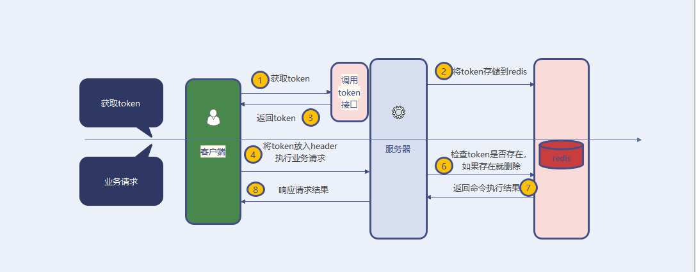

# SpringBoot接口-如何实现接口幂等

___

> 常见的保证幂等的方式包括：数据库层面、分布式锁、token机制

## 1. 数据库层面

### 1.1 悲观锁

> 典型的数据库悲观锁： `for update`

```sql
select * from t_order where order_id = trade_no for update;
```

为什么加for update就可以?

1. 当线程A执行for update，数据会对当前记录加锁，其他线程执行到此行代码的时候，会等待线程A释放锁之后，才可以获取锁，继续后续操作。
2. 事务提交时，`for update`获取的锁会自动释放。

PS：这种方式很少被使用，因为如果业务处理比较耗时，并发情况下，后面线程会长期处于等待状态，占用了很多线程，让这些线程处于无效等待状态，我们的web服务中的线程数量一般都是有限的，如果大量线程由于获取for update锁处于等待状态，不利于系统并发操作。

### 1.2 唯一ID/索引

> 针对的是**插入**操作

数据库唯一主键的实现主要是利用数据库中主键唯一约束的特性，一般来说唯一主键比较适用于“插入”时的幂等性，其能保证一张表中只能存在一条带该唯一主键的记录。

使用数据库唯一主键完成幂等性时需要注意的是，该主键一般来说并不是使用数据库中自增主键，而是使用分布式 ID 充当主键，这样才能能保证在分布式环境下 ID 的全局唯一性。

#### 去重表

去重表本质上也是一种唯一索引方案。

这种方法适用于在业务中有唯一标的插入场景中，比如在以上的支付场景中，如果一个订单只会支付一次，那么订单ID可以作为唯一标识。这时，我们就可以建一张去重表，并且把唯一标识作为唯一索引，在我们实现时，把创建支付单据和写入去重表，放在一个事务中，如果重复创建，数据库会抛出唯一约束异常，操作就会回滚。

### 1.3 乐观锁（基于版本号或者时间戳）

> 针对**更新**操作

- **使用版本号或者时间戳**

这种方法适合在更新的场景中，比如我们要更新商品的名字，这时我们就可以在更新的接口中增加一个版本号，来做幂等

```java
boolean updateGoodsName(int id, String newName, int version);
```

在实现时可以如下

```sql
update goods set name=#{newName},version=#{version} where id=#{id} and version<${version}
```

- **状态机**

本质上也是乐观锁，这种方法适合在有状态机流转的情况下，比如就会订单的创建和付款，订单的付款肯定是在之前，这时我们可以通过在设计状态字段时，使用int类型，并且通过值类型的大小来做幂等，比如订单的创建为0，付款成功为100。付款失败为99

在做状态机更新时，我们就这可以这样控制

```sql
update `order` set status=#{status} where id=#{id} and status<#{status}
```

## 2. 分布式锁

分布式锁实现幂等性的逻辑是，在每次执行方法之前判断，是否可以获取到分布式锁，如果可以，则表示为第一次执行方法，否则直接舍弃请求即可。

需要注意的是分布式锁的key必须为业务的唯一标识，通常用redis分布式锁或者zookeeper来实现分布式锁。

分布式锁实现方法：[分布式锁及实现方案](../分布式系统/001.分布式锁及实现方案)

## token机制

