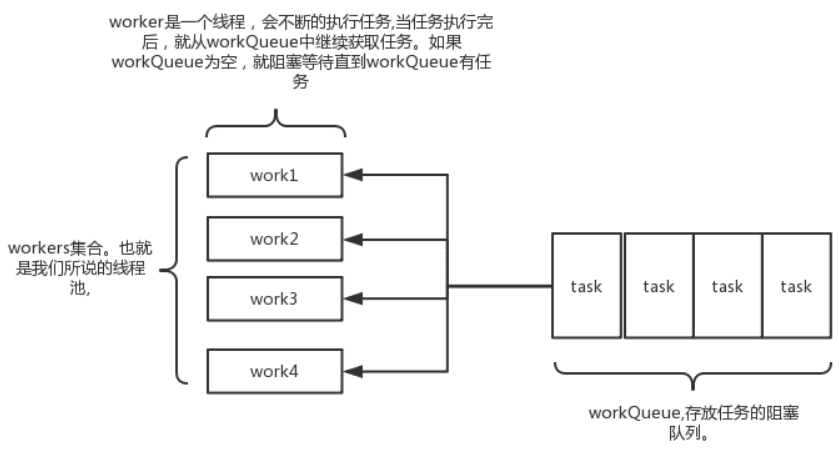

# JUC线程池-ThreadPoolExecutor

___

## ThreadPoolExecutor相关问题

1. 为什么要有线程池?
2. Java是实现和管理线程池有哪些方式? 请简单举例如何使用。
3. 为什么很多公司不允许使用Executors去创建线程池? 那么推荐怎么使用呢?
4. ThreadPoolExecutor有哪些核心的配置参数? 请简要说明
5. ThreadPoolExecutor可以创建哪是哪三种线程池呢?
6. 当队列满了并且worker的数量达到maxSize的时候，会怎么样?
7. 说说ThreadPoolExecutor有哪些RejectedExecutionHandler策略? 默认是什么策略?
8. 简要说下线程池的任务执行机制? execute –> addWorker –>runworker (getTask)
9. 线程池中任务是如何提交的?
10. 线程池中任务是如何关闭的?
11. 在配置线程池的时候需要考虑哪些配置因素?
12. 如何监控线程池的状态?

## 为什么要有线程池？

A: 线程池能够对线程进行统一分配，调优和监控。具备的优势有：

- 降低资源消耗(线程可以无限制地创建，然后使用完毕后销毁)
- 提高响应速度(无须创建线程)
- 提高线程的可管理性

## ThreadPoolExecutor使用详解

其实java线程池的实现原理很简单，说白了就是一个线程集合workerSet和一个阻塞队列workQueue。
当用户向线程池提交一个任务(也就是线程)时，线程池会先将任务放入workQueue中。
workerSet中的线程会不断的从workQueue中获取线程然后执行。
当workQueue中没有任务的时候，worker就会阻塞，直到队列中有任务了就取出来继续执行。



### Execute原理

当一个任务提交至线程池之后的流程：

1. 线程池首先检查当前运行的线程数量是否少于`corePoolSize`。如果是，则创建一个新的工作线程来执行任务。如果都在执行任务，则进入2.
2. 判断`BlockingQueue`是否已经满了，如果还没有满，则将线程放入`BlockingQueue`。否则进入3.
3. 如果创建一个新的工作线程将使当前运行的线程数量超过`maximumPoolSize`，则交给`RejectedExecutionHandler`来处理任务。

### 参数

```java
public ThreadPoolExecutor(int corePoolSize,
        int maximumPoolSize,
        long keepAliveTime,
        TimeUnit unit,
        BlockingQueue<Runnable> workQueue,
        RejectedExecutionHandler handler)
```

- `corePoolSize`: 线程池中的核心线程数，当提交一个任务时，线程池创建一个新线程执行任务，直到当前线程数等于corePoolSize,
  即使有其他空闲线程能够执行新来的任务, 也会继续创建线程；
  如果当前线程数为corePoolSize，继续提交的任务被保存到阻塞队列中，等待被执行；
  如果执行了线程池的prestartAllCoreThreads()方法，线程池会提前创建并启动所有核心线程。
- `workQueue`: 用来保存等待被执行的任务的阻塞队列. 在JDK中提供了如下阻塞队列: 具体可以参考`JUC 集合: BlockQueue详解`
    - `ArrayBlockingQueue`: 基于数组结构的有界阻塞队列，按FIFO排序任务；
    - `LinkedBlockingQueue`: 基于链表结构的阻塞队列，按FIFO排序任务，吞吐量通常要高于ArrayBlockingQueue；
    - `SynchronousQueue`: 一个不存储元素的阻塞队列，每个插入操作必须等到另一个线程调用移除操作，否则插入操作一直处于阻塞状态，吞吐量通常要高于LinkedBlockingQueue；
    - `PriorityBlockingQueue`: 具有优先级的无界阻塞队列；

LinkedBlockingQueue比ArrayBlockingQueue在插入删除节点性能方面更优，但是二者在put(), take()任务的时均需要加锁，
SynchronousQueue使用无锁算法，根据节点的状态判断执行，而不需要用到锁，其核心是Transfer.transfer().

- `maximumPoolSize`: 线程池中允许的最大线程数。
  如果当前阻塞队列满了，且继续提交任务，则创建新的线程执行任务，前提是当前线程数小于maximumPoolSize；
  当阻塞队列是无界队列, 则maximumPoolSize则不起作用, 因为无法提交至核心线程池的线程会一直持续地放入workQueue.
- `keepAliveTime`: 线程空闲时的存活时间，即当线程没有任务执行时，该线程继续存活的时间；
  默认情况下，该参数只在线程数大于corePoolSize时才有用, 超过这个时间的空闲线程将被终止；
- `unit`: keepAliveTime的单位
- `threadFactory`: 创建线程的工厂，通过自定义的线程工厂可以给每个新建的线程设置一个具有识别度的线程名。默认为DefaultThreadFactory
- `handler`: 线程池的饱和策略，当阻塞队列满了，且没有空闲的工作线程，如果继续提交任务，必须采取一种策略处理该任务，
  线程池提供了4种策略:
    - `AbortPolicy`: 直接抛出异常，默认策略；
    - `CallerRunsPolicy`: 用调用者所在的线程来执行任务；
    - `DiscardOldestPolicy`: 丢弃阻塞队列中靠最前的任务，并执行当前任务；
    - `DiscardPolicy`: 直接丢弃任务；

当然也可以根据应用场景实现RejectedExecutionHandler接口，自定义饱和策略，如记录日志或持久化存储不能处理的任务。

### 三种类型

#### newFixedThreadPool

```java
public class Executors {
    public static ExecutorService newFixedThreadPool(int nThreads) {
        return new ThreadPoolExecutor(nThreads, nThreads,
                                      0L, TimeUnit.MILLISECONDS,
                                      new LinkedBlockingQueue<Runnable>());
    }
}
```

线程池的线程数量达corePoolSize后，即使线程池没有可执行任务时，也不会释放线程。

FixedThreadPool的工作队列为无界队列LinkedBlockingQueue(队列容量为Integer.MAX_VALUE), 这会导致以下问题:

- 线程池里的线程数量不超过corePoolSize,这导致了maximumPoolSize和keepAliveTime将会是个无用参数
- 由于使用了无界队列, 所以FixedThreadPool永远不会拒绝, 即饱和策略失效

#### newSingleThreadExecutor

```java
public class Executors {
    public static ExecutorService newSingleThreadExecutor() {
        return new FinalizableDelegatedExecutorService
                (new ThreadPoolExecutor(1, 1,
                                        0L, TimeUnit.MILLISECONDS,
                                        new LinkedBlockingQueue<Runnable>()));
    }
}
```

初始化的线程池中只有一个线程，如果该线程异常结束，会重新创建一个新的线程继续执行任务，唯一的线程可以保证所提交任务的顺序执行.

- 由于使用了无界队列, 所以SingleThreadPool永远不会拒绝, 即饱和策略失效

#### newCachedThreadPool

```java
public class Executors {
    public static ExecutorService newCachedThreadPool() {
        return new ThreadPoolExecutor(0, Integer.MAX_VALUE,
                                      60L, TimeUnit.SECONDS,
                                      new SynchronousQueue<Runnable>());
    }
}
```

线程池的线程数可达到Integer.MAX_VALUE，即2147483647，内部使用SynchronousQueue作为阻塞队列；
和newFixedThreadPool创建的线程池不同，newCachedThreadPool在没有任务执行时，当线程的空闲时间超过keepAliveTime，会自动释放线程资源，
当提交新任务时，如果没有空闲线程，则创建新线程执行任务，会导致一定的系统开销；

执行过程与前两种稍微不同:

1. 主线程调用SynchronousQueue的offer()方法放入task, 倘若此时线程池中有空闲的线程尝试读取 SynchronousQueue的task,
   即调用了SynchronousQueue的poll(), 那么主线程将该task交给空闲线程. 否则执行(2)
2. 当线程池为空或者没有空闲的线程, 则创建新的线程执行任务.
3. 执行完任务的线程倘若在60s内仍空闲, 则会被终止. 因此长时间空闲的CachedThreadPool不会持有任何线程资源.

### 关闭线程池

遍历线程池中的所有线程，然后逐个调用线程的interrupt方法来中断线程.

#### 关闭方式 - shutdown

将线程池里的线程状态设置成SHUTDOWN状态, 然后中断所有没有正在执行任务的线程.

#### 关闭方式 - shutdownNow

将线程池里的线程状态设置成STOP状态, 然后停止所有正在执行或暂停任务的线程.

**只要调用这两个关闭方法中的任意一个, isShutDown() 返回true.**

**当所有任务都成功关闭了, isTerminated()返回true.**

## 任务的执行

> execute -> addWorker -> runWorker(getTask)

线程池的工作线程通过Woker类实现，在ReentrantLock锁的保证下，把Woker实例插入到HashSet后，并启动Woker中的线程。
从Woker类的构造方法实现可以发现: 线程工厂在创建线程thread时，将Woker实例本身this作为参数传入，当执行start方法启动线程thread时，本质是执行了Worker的runWorker方法。
firstTask执行完成之后，通过getTask方法从阻塞队列中获取等待的任务，如果队列中没有任务，getTask方法会被阻塞并挂起，不会占用cpu资源；

## 任务的提交

## 任务的关闭

## 更深入理解

### 为什么线程池不允许使用Executors去创建？推荐的方式是什么？

线程池不允许使用Executors去创建，而是通过ThreadPoolExecutor的方式，这样的处理方式让写的同学更加明确线程池的运行规则，规避资源耗尽的风险。

Executor各个方法的弊端：

- newFixedThreadPool和newSingleThreadExecutor：主要问题是堆积的请求处理队列可能会耗费非常大的内存，甚至OOM。
- newCacheThreadPool和newScheduledThreadPool：主要问题是线程数最大值是Interger.MAX_VALUE，可能会创建非常多的线程，甚至OOM。

**推荐方式：**

#### 推荐方式一

引入`commons-lang3`包

```java
ScheduledExecutorService executorService=new ScheduledThreadPoolExecutor(1,
        new BasicThreadFactory.Builder().namingPattern("example-schedule-pool-%d").daemon(true).build());
```

#### 推荐方式二

引入`com.google.guava`包

```java
ThreadFactory namedThreadFactory=new ThreadFactoryBuilder().setNameFormat("demo-pool-%d").build();

//Common Thread Pool
        ExecutorService pool=new ThreadPoolExecutor(5,200,0L,TimeUnit.MILLISECONDS,new LinkedBlockingQueue<Runnable>(1024),namedThreadFactory,new ThreadPoolExecutor.AbortPolicy());

// excute
        pool.execute(()->System.out.println(Thread.currentThread().getName()));

        //gracefully shutdown
        pool.shutdown();
```

#### 推荐方式三

spring配置线程池方式：自定义线程工厂bean需要实现ThreadFactory，可参考该接口的其它默认实现类，使用方式直接注入bean调用execute(
Runnable task)方法即可

```xml
<bean id="userThreadPool" class="org.springframework.scheduling.concurrent.ThreadPoolTaskExecutor">
    <property name="corePoolSize" value="10"/>
    <property name="maxPoolSize" value="100"/>
    <property name="queueCapacity" value="2000"/>

    <property name="threadFactory" value= threadFactory/>
    <property name="rejectedExecutionHandler">
        <ref local="rejectedExecutionHandler"/>
    </property>
</bean>

        //in code
        userThreadPool.execute(thread);
```

### 配置线程池需要考虑的因素

从任务的优先级，任务的执行时间长短，任务的性质(CPU密集/IO密集)，任务的依赖关系这四个角度分析。

并且尽可能地使用有界的工作队列。

性质不同的任务可以使用不同规模的线程池分开处理：

- CPU密集型：尽可能少的线程，`Ncpu + 1`
- IO密集型：尽可能多的线程，`Ncpu * 2`，比如数据库连接池
- 混合型：CPU密集型的任务与IO密集型任务的执行时间差别较小，拆分为两个线程池；否则没有必要拆分。

### 监控线程池的状态

可以使用ThreadPoolExecutor以下方法：

- `getTaskCount()` Returns the approximate total number of tasks that have ever been scheduled for execution.
- `getCompletedTaskCount()` Returns the approximate total number of tasks that have completed execution.
  返回结果少于getTaskCount()。
- `getLargestPoolSize()` Returns the largest number of threads that have ever simultaneously been in the pool.
  返回结果小于等于maximumPoolSize
- `getPoolSize()` Returns the current number of threads in the pool.
- `getActiveCount()` Returns the approximate number of threads that are actively executing tasks.